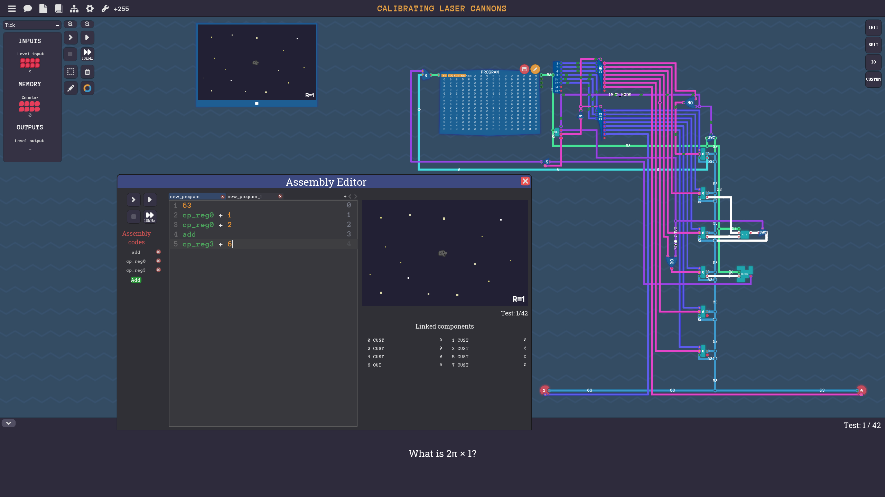

# About project

This project simulates a simple **8-bit CPU architecture** from the game Turing Complete.
You can learn more about the game [here](https://store.steampowered.com/app/1444480/Turing_Complete/).

This version reproduces the first iteration of the CPU featured in the game and allows you to write simple programs using a custom assembler.
The available commands are listed in the `assembly_commands.txt` 

# Architecture overview



current CPU architecture includes the following core components:
- **Registers:** 6 registers, numbered **0–5**.
- **ROM:** 256 bytes of program memory, storing one byte per instruction step.
- **I/O:** Basic input and output interfaces for interaction with the program.

### Register Roles
| Register | Purpose |
|:----------|:--------|
| R0         | Used for **jump addresses** (program control flow). |
| R1, R2     | Act as **inputs to the ALU** (Arithmetic Logic Unit). |
| R3         | Used as the **ALU output** and as an **input to the conditional module**. |
| R4, R5     | Currently **free for general use** in user programs. |

Each instruction is fetched and executed in **single-byte steps**, making the system simple and predictable for low-level experimentation.

# Examples 

The `sandbox` folder contains two example programs that demonstrate basic CPU operations.

### Example 1

To run the first example, execute:
```bash
bin/sandbox.elf --verbose 2 sandbox/sandbox_code_example.asm
```
After running this command, press `e` to execute.
This program pushes the value **63** into registers **R1** and **R2**, then **adds** them and **sends the result to the output**.
Execution logs will be saved to `sim_info.txt`.

### Example 2

To run the second example, execute:
```bash
bin/sandbox.elf --verbose 2 sandbox/example_2.asm
```
After running this command, press `e` to execute.
This program pushes **63** into register **R1**, **23** into register **R2**, then **subtracts 23 from 63 and sends the result to the output**.
Execution logs will be saved to `sim_info.txt`.

# How to use

 ### 1. Compile the project

Run:

```bash
make
```
 ### 2. Choose verbosity level

When executing your program, you can use the `--verbose` flag to control the amount of information printed during execution:
- `0` (or no flag): run silently
- `1`: show minimal information
- `2`: show full information

*All output files will be created in the same folder after your program finishes running.*
### 3. Write and run programs

You have two main options:

**a)Completing Tasks**

- Navigate to the `tasks` folder.
- Pick an interesting task and read its description in the `todo` file.
- Create a new file (e.g. `my_solution.asm`) in the same folder.
- Write your assembler code using the available commands (listed in the `assembly_commands.txt`)
- Finally, run your program with the following command:
```bash
bin/tasks/task_name.elf --verbose 0-2 path_to_your_asm_file
```
#### Example
```bash
bin/tasks/task_1_add_five.elf --verbose 1 tasks/task_1_add_five/solution.asm
```

**b)Sandbox Mode**
- In the ``sandbox`` folder, create an ``.asm`` file with any name.
- Write your custom code there.
- Run it with the sandbox executable:
```bash
bin/sandbox.elf --verbose 0-2 sandbox/your_file.asm
```
#### Example
```bash
bin/sandbox.elf --verbose 1 sandbox/sandbox_code_example.asm
```
## Important rule for using Input/Output 

I/O operations **cannot be used in the sandbox**.
They are only available inside **tasks**, where they behave either according to the **general rule** or as specified in the task’s ``todo`` file.

### General Rule

- **Reading from input** provides a **new value** on each read.
- **Writing to output** compares the **sent value** against the **expected result** defined for the task.

